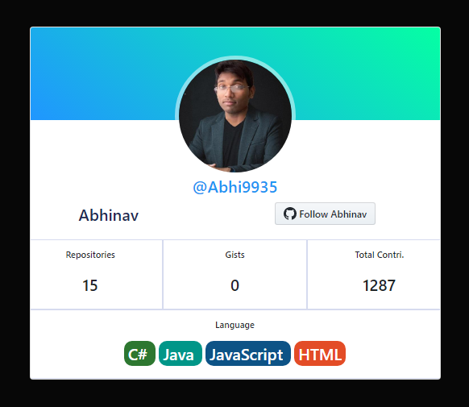

# FrontEndLab
###### author: [**Abhinav Kushwaha (Baba Albus)**](http://babaalbus.com/ "http://babaalbus.com/")
---
## FreeCodeCamp Projects 
  #### [Responsive Web Design Projects](https://www.freecodecamp.org/certification/babaalbus/responsive-web-design)
1. [Tribute Page](https://abhi9935.github.io/FreeCodeCamp_TributePage/)
2. [Survey Form](https://abhi9935.github.io/FreeCodeCamp_SurveyForm/)
3. [Product Landing Page](https://abhi9935.github.io/FreeCodeCamp_ProductLandingPage/)
4. [Portfolio](https://abhi9935.github.io/FreeCodeCamp_PersonalPortfolioWebpage/)
5. [Technical Documentation Page](https://abhi9935.github.io/FreeCodeCamp_TechnicalDocumentationPage/)
---
## Templates
| SR no. | Template | Preview |
| ------ | -------- | ------- |
| 1. | Socail Network |  |
| 2. | GitHub Profile Card |  |
